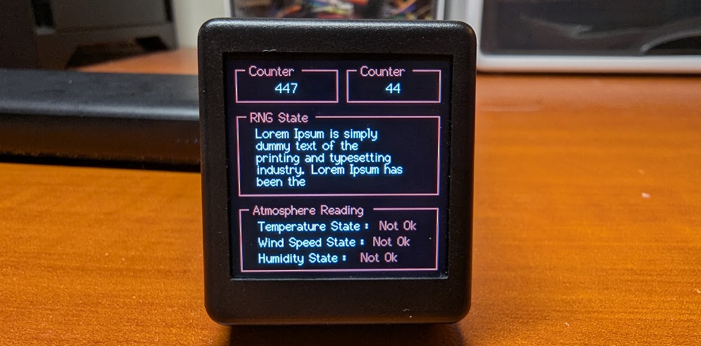
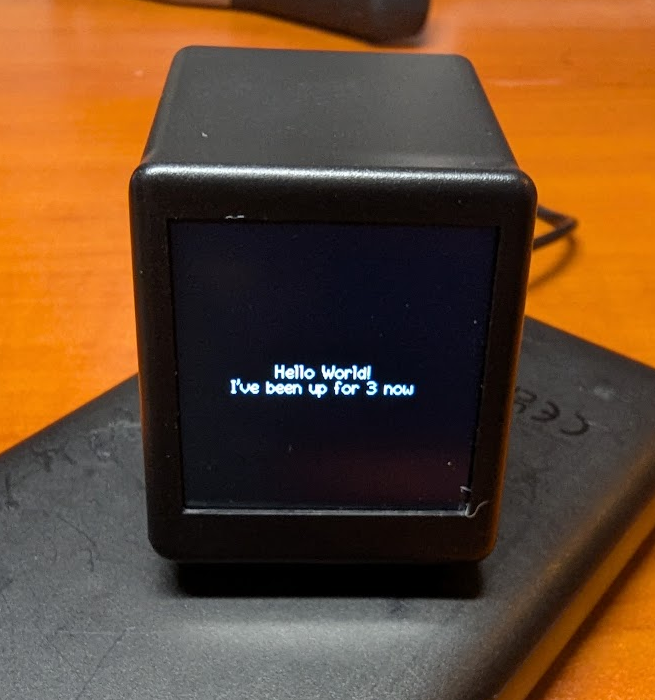
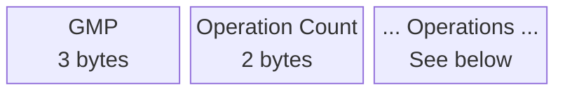
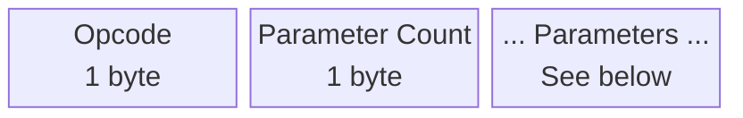
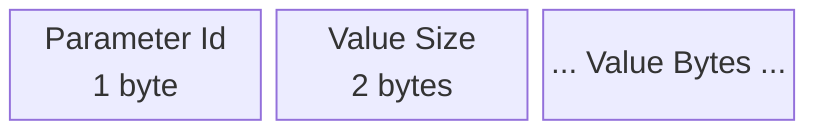

# 🐸 Geekmagic Remote Renderer
This is a custom firmware for the GeekMagic Display that accepts rendering instructions via a custom protocol. The idea being that you can easily and rapidly develop a UI without continuously sending over new firmware to the display.

This combined with a custom react renderer, it lets you create a usable UI within minutes. Content is layouted to web standard (mostly) with the help of [Yoga Layout](https://www.yogalayout.dev) and state is fully managed by React. I was **heavily** inspired by the [Ink](https://github.com/vadimdemedes/ink) project to implement the react renderer



## Example 
```tsx
import CreateRenderer from "@geekmagic-react/create-renderer.js";
import { Box, Text } from "@geekmagic-react/elements.js";
import { config } from "dotenv";
import { useEffect, useState } from "react";

function App() {
	const [seconds, setSeconds] = useState(0);

	useEffect(() => {
		const interval = setInterval(() => {
			setSeconds((prev) => prev + 1);
		}, 1000);
		return () => clearInterval(interval);
	}, []);

	return (
		<Box tb="p-[20] flex items-center justify-center w-[240] h-[240]">
			<Text>Hello World!</Text>
			<Text>I've been up for {seconds} now</Text>
		</Box>
	);
}

config();

const [_, render] = await CreateRenderer({
	host: process.env.DISPLAY_ADDRESS as string,
	port: 81,
});

render(<App />);
```


## Setup & Installation
Right now you can just build it via [PlatformIO](https://platformio.org/install/ide?install=vscode) and send it over the ESP12F via a [CH343 board](https://www.waveshare.com/wiki/CH343_USB_UART_Board). You can get these for pretty cheap on Aliexpress. I'll work on an easier way to upload the firmware in the future

## Known Limitations & Bugs
- [ ] Font rendering
	- Fonts are loaded as .vlw files. And the glyph dimensions have to be explicitly specified so they can blitted properly during updates. And thanks to this fact only monospace fonts are properly supported right now
- [ ] Images cannot be sent over the websocket. Right now images have to be pre-loaded along with files. I think I can live with that tho
- [ ] Tailbreeze, the super simplified version of Tailwind I implemented has a lot of missing fields

## Websocket Protocol (GRRP)
GMRRP stands for `Geekmagic Remote Render Protocol`. It's not the best design but it gets the job done. Each rendering instruction packet can store 65535 operations. Each operation can have 255 parameters and each parameter can have a max value size of 65535 bytes.

### Packet format
This is the first level of the packet. It just has a header, and operation count. Followed by a series of the Operation Structure
| Field      | Description |
|------------|-------------|
| GMP        | Magic header identifying the protocol |
| Count      | Number of operations (16-bit unsigned integer, little-endian) |
| Operations | Concatenated binary operation records. Can support 65535 operations |



### Operation Structure
This is the operation structure. It has an opcode, parameter count and finally followed by a series of the parameter structure. See the declaration file to see a list of available operations
| Field           | Description |
|-----------------|-------------|
| Opcode          | Identifies the operation |
| Parameter Count | Number of parameters in the operation (8-bit unsigned integer, little-endian) |
| Parameters      | Operation parameters. Can support 255 parameters |




### Parameter Structure
This is the parameter structure. It has a parameter Id, value size and value bytes. If a parameter ID that is not required for a operation is sent, that parameter will just be ignored. See the declaration to see a list of available parameters
| Field           | Description |
|-----------------|-------------|
| Parameter Id    | Identifies the parameter |
| Value Size      | Size of the value in bytes (8-bit unsigned integer, little-endian) |
| Value Bytes      | Actual Value Bytes. Can support 65535 bytes |


